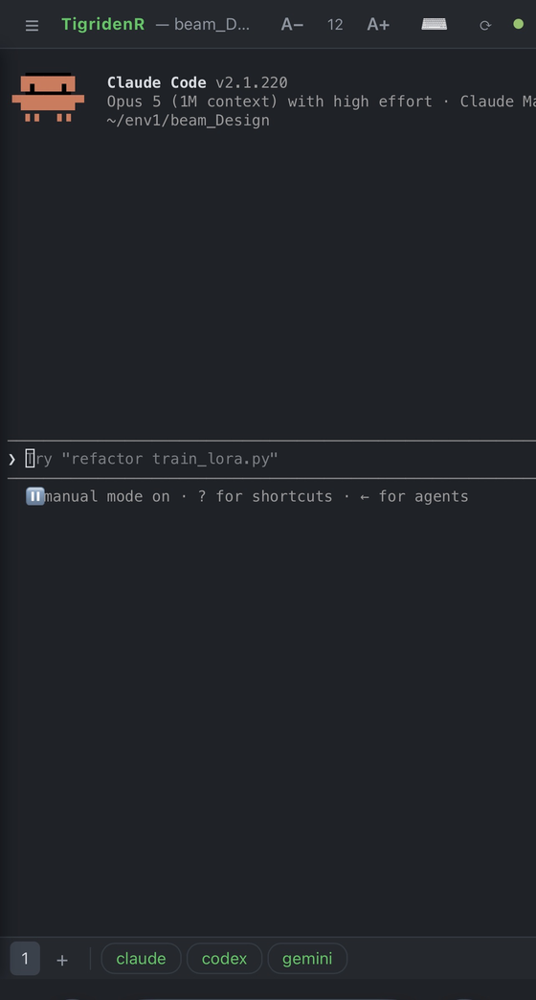

# TigridenR — the tiny agentic workbench you can run from anywhere

  

**A tiny workbench for supervising AI coding agents — on your desk, and in your pocket.**

Run `claude`, `codex`, `gemini` — any terminal agent — each in its own folder, side by side. Every workspace gets an embedded terminal, a live file tree, a lightweight editor, and change tracking with one-click rollback. Then leave the desk: **TigridenR mirrors the whole workbench to a web page**, so you can watch an agent think, answer its questions, and kick off the next task from your phone on the couch — or from anywhere on your [Tailscale](https://tailscale.com) network.

No run/debug tooling, no chat panel, no LSP. The agents do the heavy lifting; TigridenR gives you eyes and hands — local or remote.

Written in pure Rust. **13–18 MB binary; ~60 MB RAM idle, ~5 MB headless** — no Electron, no webview, no bundled browser. ([measured](#memory-use))


*Above: a real session — the agent's workspace file tree on the left, the built-in viewer inspecting a chart the agent just generated, and the agent CLI running in one of three terminal tabs below.*

## Why

Agentic coding means running several agents in several folders and *checking in on them* — and the checking-in doesn't stop when you stand up. A full IDE is overkill; a bare terminal multiplexer has no file browser, no editor, no diff view, and no way to peek from your phone. TigridenR is the minimal middle:

- **One session per folder** — agent, files, editor, and change tracking together.
- **One URL for the whole thing** — the same terminals, sidebar, and agent buttons in any browser, secured by your tailnet.

## Remote: run your agents from the web

The desktop app and every browser client share the **same live shells** — it's a tmux-style attach, not a screen-share. Output mirrors everywhere in real time; anyone attached can type. Start Claude Code at your desk, then approve its plan from your phone in the kitchen; the desktop window shows every keystroke.

**What the web page gives you** (it mirrors your desktop theme, accent and font — change them in Settings and the browser follows):

- The **terminal** (xterm.js) with full TUI support — attaching mid-`vim` or mid-agent-session replays the current screen (plus up to 2,000 lines of recent scrollback) straight from the terminal grid, so you never land on a blank page.
- The **agent sidebar** — your folders and their browseable file trees (tap to expand/collapse), the live **Changes (N)** list of what the agent touched (with a toggle button), and a **tap-to-view file reader**: tap any file to read its contents full-screen (text files, capped at 512 KB; viewing only — editing stays on the desktop).
- **Terminal tabs and preset buttons** — switch folders and shells, open or close terminals, and launch `claude`/`codex`/`gemini` with one tap.
- **Attach a file to the agent** — drag a screenshot onto the page (or tap **📎** on a phone to pick from the photo library, camera or Files; pasting an image works too). The browser has no access to a real path — and is usually on another machine anyway — so the file is copied to the host and *its* path is typed into the terminal, shell-quoted, exactly like a desktop drag-and-drop. Uploads land in `~/Library/Application Support/tigridenr/uploads/`, outside your project folders, so they never show up in the file tree or the Changes panel. 25 MB per file.
- A **phone-friendly layout** — drawer sidebar, soft-keyboard button, a ⟳ resync button, and font auto-fit to the host's grid width.



### From your phone

The same session, in your pocket — this is Claude Code running on the Mac, driven from an iPhone over Tailscale:

1. **On the Mac** — **Settings** (⌘,) **▸ Remote Access ▸ On**. Copy the `…ts.net` URL it shows.
2. **On the phone** — open the Tailscale app and connect (same account as the Mac), then open that URL in Safari or Chrome.
3. Tap **⌨** to raise the keyboard and type — the desktop shows every keystroke, and its output comes straight back.

Around the terminal: **☰** opens the folder sidebar, **A− / A+** size the text (tap the number for auto-fit), **⟳** repaints from the host if a flaky connection leaves the screen stale, and the dot on the right is green while connected. Along the bottom are the terminal tabs, **+** for a new shell, and your agent presets — so you can start `claude` on a folder without touching the Mac.

Add it to your home screen (Safari ▸ Share ▸ **Add to Home Screen**) and it opens like an app — that works best once HTTPS certificates are enabled on your tailnet, which the Tailscale setup section below covers.

<br clear="right">

**Every window can serve its own port.** Turn remote access on per window and give each a different port (Settings ▸ Remote Access), so a "reviewers" window and a "build" window are two separate URLs. A window's page only ever sees that window's folders and shells.

**Turn it on** (one of):

1. **In the app:** **Settings** (⌘,) **▸ Remote Access ▸ On** — also reachable via **File ▸ Remote Access…**. Set the port there; the URL to open is shown beneath it.
2. **In config** (`~/Library/Application Support/tigridenr/config.toml`):

   ```toml
   [remote]
   enabled = true
   port = 8620
   ```

3. **Headless** — no window, no display needed (a Mac mini in a closet, over SSH):

   ```sh
   tigridenr --headless ~/code/project         # serve one folder
   tigridenr --headless ~/code/a ~/code/b      # several, as separate sessions
   tigridenr --headless --port 9000 ~/code/x   # on a specific port
   tigridenr --headless                        # folders from your last GUI session
   ```

   `tigridenr --help` lists every flag. In headless mode the *browser* drives the terminal size — rotate your phone and the PTY follows. When the desktop GUI is running, its pane owns the grid and browsers mirror it. Change tracking is always on headless, so the Changes list works from the first connection.

Stopping the server (Ctrl-C, or quitting the app) removes the `tailscale serve` config too, so the published URL never lingers pointing at a dead port.

**Security = Tailscale, by design.** The server never binds anything but `127.0.0.1`. Reachability comes exclusively from `tailscale serve`, which publishes it on your tailnet and admits only devices logged into your account. There is no separate password — access control *is* your tailnet, and anyone who can open the page has full shell access as your user, so treat tailnet membership accordingly. No Tailscale? The server still runs, but only reachable on the machine itself (`http://127.0.0.1:<port>`).

<details>
<summary><b>Setting up Tailscale</b> — one-time, ~5 minutes</summary>

TigridenR drives the Tailscale CLI for you; you just need Tailscale installed and logged in on both devices.

**1. On the Mac running TigridenR**

Install it ([download](https://tailscale.com/download/mac), or `brew install --cask tailscale`), open the app, and sign in — any Google/GitHub/Microsoft account works and creates your private network ("tailnet") on first login.

Check it's up:

```sh
tailscale status          # should list your machine, not "Logged out"
```

**2. On your phone**

Install the Tailscale app (App Store / Play Store), sign in with **the same account**, and toggle the VPN on. That's the whole pairing step — devices on one account see each other automatically.

**3. Turn on remote access in TigridenR**

Settings (⌘,) ▸ Remote Access ▸ **On**. The status line shows your address:

```
http://<your-machine>.<your-tailnet>.ts.net
```

Open that on the phone. The name is read from `tailscale status` at runtime — nothing is hardcoded, so it is automatically correct for whatever machine you run on. Rename the machine in the [admin console](https://login.tailscale.com/admin/machines) and the URL follows.

**4. Optional but recommended: enable HTTPS**

By default you get `http://` over the tailnet — traffic is still encrypted by WireGuard, but browsers treat it as insecure, which blocks clipboard access and "Add to Home Screen".

To get a real `https://` address, open [**admin console ▸ DNS**](https://login.tailscale.com/admin/dns) and click **Enable HTTPS Certificates**. Then toggle Remote Access off and on; TigridenR notices the certificates and switches to `https://` automatically.

**Troubleshooting**

| Status line says | Fix |
|---|---|
| `Tailscale is not installed` | Install it. TigridenR looks on `$PATH`, then `/usr/local/bin`, `/opt/homebrew/bin`, and the app bundle. |
| `found Tailscale but its CLI would not answer` | The app bundle's binary needs a GUI session and won't answer when TigridenR is launched from Finder. Install the CLI: **Tailscale menu ▸ Install CLI**, or `brew install tailscale`. |
| `Tailscale is not running — open the Tailscale app and log in` | Sign in, or the VPN toggle is off. |
| `no tailnet DNS name (MagicDNS off?)` | Enable MagicDNS in [admin ▸ DNS](https://login.tailscale.com/admin/dns). |
| Page won't load on the phone | Check the Tailscale toggle is on there and it's the same account. |
| `502` from the URL | The server isn't running any more — start TigridenR (recent versions clean this up on exit). |

**Good to know:** `tailscale serve` publishes one address per machine, so only one window (or a headless server) can hold the tailnet URL at a time — the rest stay reachable at `127.0.0.1:<port>` locally. Tailscale's free plan covers personal use comfortably. And **Funnel** (public internet exposure) is deliberately *not* used: your workbench is a shell, so it stays tailnet-only.

</details>

Everything the page needs (HTML/CSS/JS and a vendored [xterm.js](https://github.com/xtermjs/xterm.js)) is embedded in the binary — no CDN, works on a tailnet with no internet at all. Prefer a local-only build? `cargo build --release --no-default-features` compiles the whole feature out.

## Features (the local half)

- **One-click agents** — preset buttons type the agent command into the terminal for you (fully configurable).
- **Multiple terminals per folder** — the `+` tab spawns extra shells in the same workspace, so one agent can run while you use a second terminal for git, tests, or another agent. Tabs are switch-only; closing has its own **✕** button beside **+** and always asks first, so a mis-click can't kill a running agent.
- **Real terminal** — VTE-compliant emulation ([alacritty_terminal](https://crates.io/crates/alacritty_terminal) + a real PTY). TUIs like `vim`, `top`, and the Claude Code interface just work, including bracketed paste and truecolor. Select with the mouse and Cmd+C to copy out; Cmd+V pastes text in, and image paste into Claude Code works with Ctrl+V (the agent reads your clipboard directly).
- **Live file tree** — gitignore-aware, refreshes automatically as agents create and delete files. Right-click any entry for New File/Folder, Reveal in Finder, Open in Default App, Copy (Relative) Path, Duplicate, Rename, and Move to Trash.
- **File change tracking & rollback** — **File ▸ Show Changes Panel** lists every file the agent modified/added/deleted since the baseline, updated within ~1 s. Click a row for a syntax-highlighted diff; discard one file or the whole run, always behind a confirmation. Git folders compare against the last commit; folders **without git get invisible shadow snapshots** (stored in the app's data dir — your folder stays untouched, the agent never sees them).
- **Multiple windows & agent teams** — **File ▸ New Window** opens an independent window with its own folders. Define named preset groups (`[[teams]]` in config.toml) to give different windows different agent buttons.
- **Drag & drop files** — drop any file from Finder and its (shell-quoted) path is typed into the terminal — attach files to an agent prompt like in a native terminal.
- **Built-in editor** — syntax highlighting for 40+ languages ([cosmic-text](https://crates.io/crates/cosmic-text) + syntect), Cmd+S save, auto-reload when the agent edits the open file.
- **File viewers** — images, rendered Markdown, CSV/TSV tables, PDF text extraction.
- **Settings dialog** (⌘,) — theme (Dark/Light × Classic/Minimal/Vivid), accent color, terminal/editor font and size, interface text size, scrollback (see [memory use](#memory-use)), the Changes-panel default, and remote access (on/off + port). Appearance changes apply live to every open window and are saved to config.toml; the web client picks them up too.
- **Per-folder sessions, recent folders, native menu bar, persistent layout** — and small on purpose: no webview, no Electron, no C regex libraries.

## Install

No Rust needed — prebuilt binaries for every platform are on the [latest release](https://github.com/Sompote/TigridenR/releases/latest) (currently [v0.1.2](https://github.com/Sompote/TigridenR/releases/tag/v0.1.2)).

| Download | For |
|---|---|
| `TigridenR-macos-universal.app.zip` | **macOS — start here.** One app for Apple Silicon *and* Intel |
| `tigridenr-macos-arm64.tar.gz` | macOS bare binary, Apple Silicon |
| `tigridenr-macos-x86_64.tar.gz` | macOS bare binary, Intel |
| `tigridenr-linux-x86_64.tar.gz` | Linux x86_64 |
| `tigridenr-windows-x86_64.zip` | Windows x86_64 |

<details open>
<summary><b>macOS</b></summary>

1. Download **`TigridenR-macos-universal.app.zip`**.
2. Unzip and drag **TigridenR.app** into **/Applications**.
3. First launch only — the app isn't notarized, so **right-click ▸ Open ▸ Open**, or:

   ```sh
   xattr -dr com.apple.quarantine /Applications/TigridenR.app
   ```

Prefer a bare binary? Untar an arch-specific tarball and run `./tigridenr`.
</details>

<details>
<summary><b>Linux</b></summary>

```sh
tar -xzf tigridenr-linux-x86_64.tar.gz
./tigridenr ~/code/project
```

Install the GUI libraries it links against if they aren't already present:

```sh
# Debian / Ubuntu
sudo apt install libxkbcommon0 libxcb1 libfontconfig1 libfreetype6

# Fedora
sudo dnf install libxkbcommon libxcb fontconfig freetype
```

File dialogs go through the XDG desktop portal, so no GTK runtime is needed. Headless mode needs none of these — a server with no desktop at all can run `./tigridenr --headless ~/code/project`.
</details>

<details>
<summary><b>Windows</b></summary>

Unzip and run `tigridenr.exe`. It's a console binary, so a terminal window opens alongside the app — that's deliberate, so `--headless` output stays visible.

The shell is `%COMSPEC%` (`cmd.exe`); set `COMSPEC` to `powershell.exe` or a WSL launcher if you'd rather have those.
</details>

> **Platform status.** macOS is what TigridenR is developed and used on, and the only platform whose GUI has been exercised. The Linux build passes the full test suite on Linux; the Windows binary is cross-compiled and has not been run. Treat both as **untested** — bug reports welcome.

Every download is self-contained: the web client (HTML/CSS/JS + xterm.js) is embedded in the binary, so there is nothing else to install and no CDN to reach.

### First run

```sh
tigridenr                       # open the window, restore your last folders
tigridenr ~/code/project        # …or open specific folders
tigridenr --headless ~/code/x   # no window at all; serve it to a browser
tigridenr --help                # every flag
```

1. **+ Add folder** (⌘O) and pick a project — a login shell opens there.
2. Click **claude** / **codex** / **gemini** to launch an agent, or type any command.
3. **⌘,** ▸ **Remote Access ▸ On** to get a URL you can open on your phone.

<details>
<summary><b>Build from source</b> (stable Rust required)</summary>

```sh
git clone https://github.com/Sompote/TigridenR.git
cd TigridenR
cargo build --release
./target/release/tigridenr          # run it directly

./bundle/make-app.sh                # or build dist/TigridenR.app…
cp -R dist/TigridenR.app /Applications/   # …and install it
```

Local-only build (remote access compiled out): `cargo build --release --no-default-features`.

Cross-compiling to another OS needs that platform's system libraries, so releases are built on native runners by `.github/workflows/release.yml` — pushing a `v*` tag builds all four targets, runs their tests, and attaches the archives to the release.
</details>

## Usage

1. Click **+ Add folder** and pick a project directory — a login shell opens there.
2. Click a preset button (e.g. **claude**) to launch the agent, or type any command.
3. Watch the file tree update as the agent works; click any file to inspect or tweak it.
4. Click **+** in the terminal tab strip for more shells in the same folder; **✕** (next to **+**) closes the active one after a confirmation. Add more folders for more agents in parallel.
5. **Settings (⌘,) ▸ Remote Access ▸ On**, open the URL on your phone, and walk away — the session comes with you.

### Track & roll back what the agent changes

1. **File ▸ Show Changes Panel** — a **Changes (N)** section appears under each folder (off by default, zero overhead while off).
2. Git folders diff against the last commit; non-git folders get a shadow snapshot baseline the moment you enable the panel (under `~/Library/Application Support/tigridenr/snapshots/`; no `.git` appears in your project).
3. Changed files appear within ~1 s as `M` / `A` / `D` rows. **Click a row** for the accumulated diff; the **File** chip jumps to the editable file.
4. **Right-click ▸ Discard Changes…** reverts one file; the **↺** button reverts the whole run. Both confirm first.

The Changes list is mirrored to remote clients too — the **Changes** button in the web sidebar toggles the panel, so you can see what the agent touched (and read the files it wrote) from your phone before telling it to continue. (In `--headless` mode change tracking is always on.) Viewing diffs and discarding changes stay desktop-only for now.

### Keys

| Context  | Keys |
|----------|------|
| Terminal | everything a terminal expects: Ctrl+C/Z/D/R…, arrows, F1–F12, TUIs; drag to select (double-click = word), Cmd+C copies, Cmd+V pastes (bracketed) |
| Scrollback | wheel scrolls; **Shift+PageUp/PageDown** page through history, **Shift+Home/End** jump to its ends, **Shift+↑/↓** move a line. Unshifted keys still reach the shell, and full-screen apps (vim, less, agent TUIs) keep their own scrolling. Typing jumps back to the live edge. Same keys work in the browser. |
| Editor   | typing, arrows / Home / End / PgUp / PgDn (+Shift selects, +Alt jumps words), Cmd+A / C / X / V, Cmd+S saves |

## Memory use

Measured on macOS (resident set size, one folder open):

| | RAM |
|---|---|
| Headless (`--headless`), idle | **~5 MB** |
| Desktop window, idle | **~60 MB** |
| Desktop window, a working session | **~85–105 MB** |

The window costs what it costs — Slint plus the font system and syntax definitions are most of that 60 MB, and it barely moves while idle.

**Scrollback is what actually grows over time**, and it is the one setting worth thinking about. Each retained line costs roughly 2 KB at 80 columns (more on a wider terminal), so a terminal that has scrolled its full history holds:

| `scrollback` | Held once full (80 cols) |
|---|---|
| 1 000 | ~2 MB |
| 10 000 (default) | ~20 MB |
| 50 000 | ~100 MB |
| 100 000 | ~200 MB |

That is **per terminal**, and only once that much output has actually gone by — a fresh shell costs nothing. A headless server filling 150 000 lines at `scrollback = 100000` measured 5 MB → 205 MB. If you run agents that produce a lot of output and memory matters more than history, lower **Settings ▸ Terminal ▸ Scrollback**; closing a terminal tab releases it immediately.

To check your own:

```sh
ps -o rss=,command= -c -p "$(pgrep -n tigridenr)" | awk '{printf "%.0f MB\n", $1/1024}'
```

## Configuration

`~/Library/Application Support/tigridenr/config.toml`, created on first run:

```toml
# Everything here is editable in Settings (⌘,).
theme = "classic-dark"  # {classic,minimal,vivid}-{dark,light}
accent = ""             # "#rrggbb" to override the theme's accent
font_family = "Menlo"
font_size = 13.0        # terminal / editor
ui_font_size = 13.0     # sidebar, tabs, dialogs
scrollback = 10000      # lines kept per terminal; ~2 KB each once used
show_changes = false    # Changes panel on in new windows

[[presets]]
label = "claude"
command = "claude"
send_enter = true

[[presets]]
label = "codex"
command = "codex"

[[presets]]
label = "gemini"
command = "gemini"

# Optional: named preset groups for File ▸ New Window ▸ <team>.
[[teams]]
name = "reviewers"
[[teams.presets]]
label = "claude-review"
command = "claude /review"
send_enter = true

# Remote web access (see "Remote" above). Each window can override the
# port in Settings; this is the default new windows start from.
[remote]
enabled = false
port = 8620
```

Runtime state (restored folders, split position) lives next to it in `state.toml`; shadow snapshots live in `snapshots/`, and files attached from the web in `uploads/`. CLI: `tigridenr [--headless] [--port N] [--no-remote] [FOLDER...]` (see `--help`). Note: toggling remote access from the app re-writes `config.toml`, so hand-added comments are lost.

## Architecture

Slint provides only the chrome (sidebar, layout, splitter). The two hard parts are custom-rendered pixel panes on the CPU:

| Pane | Engine | Rendering |
|------|--------|-----------|
| Terminal | headless `alacritty_terminal` grid fed by `portable-pty` | glyphs rasterized per cell via cosmic-text's swash cache |
| Editor | cosmic-text `SyntaxEditor` (syntect highlighting) | draws itself into the same pixel-buffer canvas |

Only the PTY reader threads run in the background; rendering and editing happen on the UI thread with coalesced repaints.

The remote layer (`src/remote/`, default-on `remote` feature) is a loopback-only HTTP/WebSocket server with no async runtime — plain threads, matching the rest of the app. The PTY reader thread tees raw output to attached browser clients; a newly attached client gets the current screen serialized back to ANSI straight from the alacritty grid (recent scrollback, colors, cursor, and terminal modes included), which is why attaching mid-TUI just works. Browser keystrokes feed the same PTY writer channel the desktop uses. Sidebar state (sessions, tabs, tree, changes) streams as JSON snapshots; terminal bytes go as binary frames. Each window owns its own server and state hub, so several windows can serve several ports; because terminal ids are process-global, every remote operation is scoped to the hub that published it. In `--headless` mode a minimal session manager replaces the GUI entirely — same terminals, tree, and change tracking, no Slint or window server involved.

`vendor/cosmic-text/` is a verbatim copy of cosmic-text 0.19 with one change: its syntect dependency uses the pure-Rust `fancy-regex` engine instead of the oniguruma C library (smaller binary, no C build dependency).

### Debug builds

`cargo build --features framedump` enables the test hooks: `TIGRIDENR_DUMP=/tmp/frames` dumps both panes as PNGs, `TIGRIDENR_TEST_INPUT='claude\r'` and `TIGRIDENR_TEST_OPEN=path` script the first session, `TIGRIDENR_TEST_SETTINGS='style=vivid,font-size=16'` applies Settings edits through the real dialog callback, and `TIGRIDENR_TEST_SCROLL=1` exercises the scrollback keys and reports the viewport offset. `cargo test` covers the terminal key encoder, the theme table, and the remote snapshot/state layer.

## Roadmap / known limitations (v1)

- [ ] Editor undo
- [ ] Mouse reporting to TUIs on the desktop (the web terminal already does it)
- [ ] IME / dead-key composition
- [ ] Editor tabs (currently one open file per session)
- [ ] PDF page rendering (currently text extraction)
- [ ] Linux / Windows testing
- [ ] Web: file editing, diff viewer, and discard actions (currently terminal + file viewing)
- [ ] Web: adding/removing folders remotely (folders come from the desktop or the last saved session)

## License

MIT
